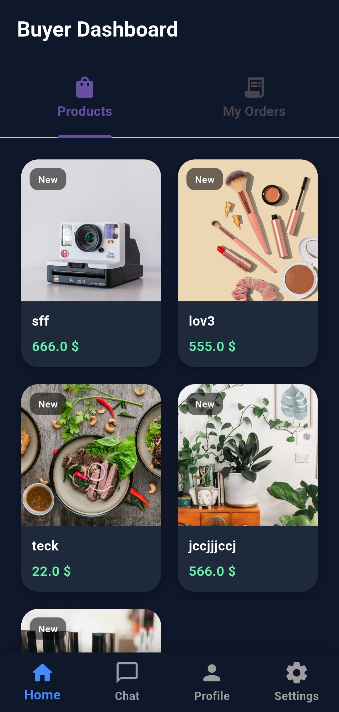
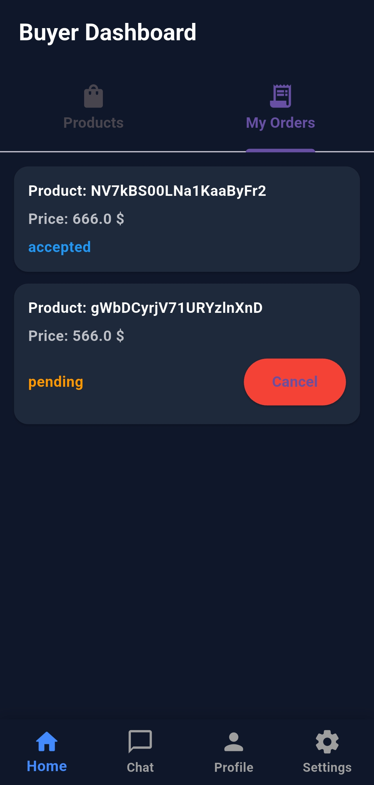
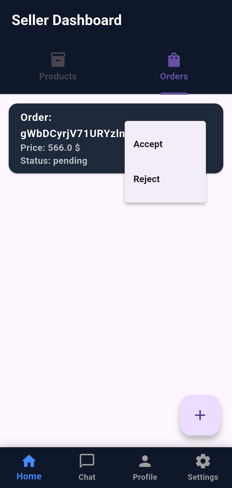
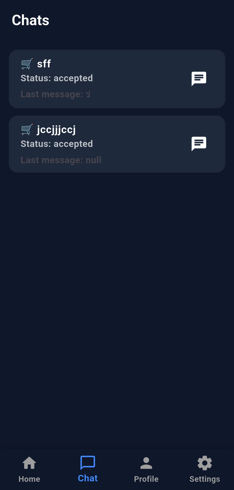
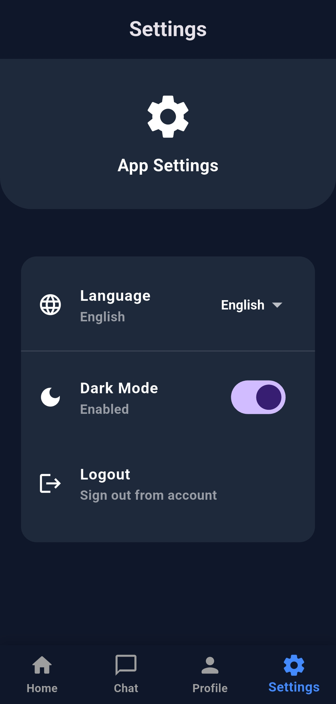

# Marketplace App 🛒💬

A full-featured Flutter marketplace application that connects merchants and customers in one platform.

## 📱 Overview

This app allows merchants to manage their products and orders, while customers can browse products, place orders, and communicate directly after order approval.

## ✨ Features

### 👨‍💼 Merchant Features
- Add Products
- View Incoming Orders
- Accept or Reject Orders
- Chat with customers after accepting an order
- Manage Profile
- Settings Page

### 👤 Customer Features
- Browse All Products
- View Product Details
- Place Orders
- View Order Status
- Chat with merchant after order approval
- Manage Profile
- Settings Page

## 🔐 Authentication
- Login / Register
- Secure User Access
- Role-based Navigation (Merchant / Customer)

## 💬 Real-time Chat
- Instant messaging between merchant and customer after order approval.

## 📦 Order Management
- Pending Orders
- Accepted Orders
- Rejected Orders

## 🛠️ Built With

- Flutter
- Dart
- Firebase 
- State Management Riverpod

## 📸 Screenshots

<p align="center">
  
  
  
</p>

<p align="center">
  
  
  
</p>

<p align="center">
  
  
  
</p>

<p align="center">
  
  
  
  
</p>


## 🚀 Getting Started

```bash
flutter pub get
flutter run


--Mohammed AlShweikh--